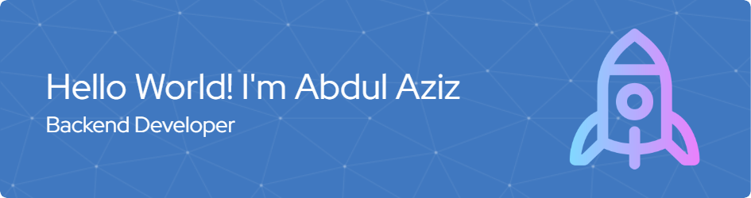

## Hi World! I'm Abdul Aziz 👋

- 🔭 I’m currently intern on **Kominfo Banjarnegara**
- 🌱 I’m currently learning [**Laravel**](https://laravel.com) Framework
- 😁😁😁

---

### 🧠 Skills

  
  
  
  
  
  
  
  
  
  
  
  
  
  
  
  
  
  
  

---

### 🔗 Connect With Me

---

### 📊 My Github Stats

---

### 🐍 Snake Eating My Contributions

